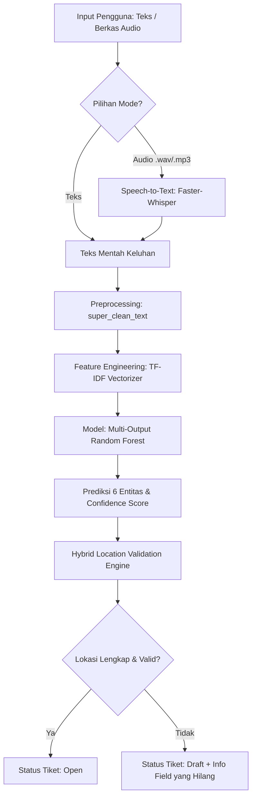
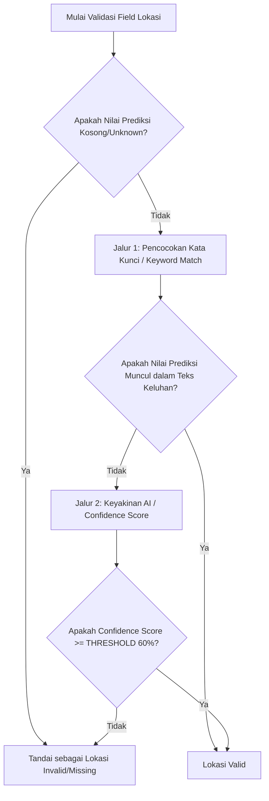

# RANGKUMAN TEKNIS LAPORAN AKHIR: MODUL NLP EXIGEN SMART MAINTENANCE

Rangkuman komprehensif ini disusun berdasarkan kode implementasi aktual pada sistem NLP (*Natural Language Processing*) Exigen Smart Maintenance. Modul NLP ini bertugas mengolah input keluhan (baik berupa teks langsung maupun rekaman suara) untuk secara otomatis memprediksi metadata tiket pemeliharaan, memvalidasi kelengkapan informasi, dan menyediakan REST API Gateway yang terintegrasi dengan frontend Next.js.

---

## DAFTAR BAB DAN SUB-BAB MODUL NLP

* **BAB I PENDAHULUAN**
  * 1.1 Deskripsi Solusi NLP Smart Helpdesk
  * 1.2 Lingkup Entitas dan Target Prediksi
  * 1.3 Alur Kerja Umum Sistem (Teks dan Suara)
* **BAB II DATASET GENERATION DENGAN LARGE LANGUAGE MODEL**
  * 2.1 Konfigurasi Sintesis Data via Groq API
  * 2.2 Aturan Prompting & Gaya Bahasa Keluhan Awam (Anti-Template)
  * 2.3 Formulasi Biaya Perbaikan dan Noise Reduction Severity
* **BAB III FILTERING & CLEANING DATASET**
  * 3.1 Pendeteksian Halusinasi Lokasi LLM
  * 3.2 Eliminasi Outlier dan Keluhan Anomali Non-Logis
  * 3.3 Harmonisasi Penamaan Lantai dan Zona
* **BAB IV TEKS PREPROCESSING & KUSTOM KANONIKAL BINDING**
  * 4.1 Konstruksi Kamus Slang Hybrid (Publik & Industri Kustom)
  * 4.2 Teknik Lexicon Location Binding (Perlindungan Karakter Tunggal)
  * 4.3 Pipeline Normalisasi Teks (*Super Clean*)
* **BAB V AUGMENTASI DATA MULTI-THREADED**
  * 5.1 Implementasi Back-Translation (ID-EN-ID)
  * 5.2 Strategi Penyeimbangan Kelas (Class Balancing) Berbasis Severity
  * 5.3 Optimasi Concurrency ThreadPoolExecutor
* **BAB VI MODELING & PIPELINE TF-IDF - MULTI-OUTPUT RANDOM FOREST**
  * 6.1 Ekstraksi Fitur N-Gram Term Frequency-Inverse Document Frequency (TF-IDF)
  * 6.2 Arsitektur Multi-Output Classifier Random Forest
  * 6.3 Eksperimen & Registrasi Model Menggunakan MLflow dan DagsHub
* **BAB VII EVALUASI MODEL**
  * 7.1 Metrik Exact Match Ratio (EMR)
  * 7.2 Laporan Evaluasi Klasifikasi per Entitas
* **BAB VIII INFERENCE ENGINE & API GATEWAY DEPLOYMENT**
  * 8.1 Transkripsi Suara Offline dengan Faster-Whisper
  * 8.2 Algoritma Validasi Lokasi Hybrid (Keyword vs AI Confidence)
  * 8.3 Penentuan Status Tiket (*Open* vs *Draft*)
  * 8.4 Spesifikasi Endpoint REST API FastAPI
* **BAB IX KESIMPULAN**
  * 9.1 Ringkasan Capaian Modul NLP

---

## BAB I: PENDAHULUAN

### 1.1 Deskripsi Solusi NLP Smart Helpdesk
Modul NLP pada **Exigen Smart Maintenance** merupakan mesin kecerdasan buatan (*helpdesk automation*) yang dirancang untuk mempercepat proses pelaporan kerusakan aset di area operasional. Sistem ini mengeliminasi proses penginputan manual tiket pemeliharaan yang memakan waktu dengan cara membaca keluhan bernada awam dari staf dan secara otomatis mengekstrak informasi teknis yang dibutuhkan untuk penanganan cepat. Modul ini mendukung dua jenis input utama:
1. **Ketikan Teks Langsung**: Keluhan yang dikirimkan via WhatsApp atau formulir web.
2. **Rekaman Suara (Audio)**: Berkas audio keluhan suara staf lapangan yang dikirimkan via antarmuka suara.

### 1.2 Lingkup Entitas dan Target Prediksi
Modul NLP dilatih untuk mengenali dan memprediksi **6 entitas target** sekaligus (Multi-Output Classification) dari satu teks keluhan:
1. `tipe_aset`: Jenis alat/fasilitas yang rusak (contoh: AC, CCTV, Lampu, Pompa Air).
2. `lokasi_gedung`: Nama atau blok gedung tempat aset berada (contoh: Gedung A, Gedung B, Gedung C).
3. `lokasi_lantai`: Tingkat lantai lokasi kerusakan (contoh: Lantai 1, Lantai 2, Lantai Mezzanine).
4. `lokasi_zona`: Wilayah spesifik di lantai tersebut (contoh: Zona Utara, Zona Barat, Zona Lounge).
5. `kategori_dept`: Departemen/tim teknis penanggung jawab (contoh: MEP, Civil, IT).
6. `severity_awal`: Tingkat keparahan kerusakan awal (contoh: Ringan, Sedang, Berat, Fatal).

### 1.3 Alur Kerja Umum Sistem (Teks dan Suara)
Berikut adalah visualisasi alur pemrosesan dari input mentah hingga menjadi tiket pemeliharaan terstruktur:



---

## BAB II: DATASET GENERATION DENGAN LARGE LANGUAGE MODEL

### 2.1 Konfigurasi Sintesis Data via Groq API
Untuk melatih model klasifikasi yang handal, dibuat generator dataset sintetis berbasis LLM. Generator ini memanfaatkan API **Groq AI** dengan model **`llama-3.3-70b-versatile`** untuk membuat variasi keluhan realistis berdasarkan data master aset perusahaan.
* **Input Generator**: Menggabungkan data dari `master_aset_enriched.xlsx` (kombinasi valid kategori, tipe, merek, gedung, lantai, dan zona) dan `aset_komplain_enriched.xlsx` (daftar severity, penyebab, jenis kerusakan, dan rentang biaya).
* **Konfigurasi API**:
  * `temperature = 0.8` (untuk memastikan kreativitas penulisan keluhan bervariasi).
  * `max_tokens = 2000` per pemanggilan API.
  * Jeda waktu (*delay*) `time.sleep(10)` antar request untuk mencegah batasan *rate limit* API.

### 2.2 Aturan Prompting & Gaya Bahasa Keluhan Awam (Anti-Template)
Untuk memastikan data latih mencerminkan kondisi lapangan yang sebenarnya, LLM diinstruksikan menghasilkan tepat 3 baris data CSV untuk setiap variasi skenario kerusakan dengan 4 gaya bahasa yang berbeda di setiap barisnya:
* **Baris 1 (Gaya Pesan WhatsApp)**: Panjang, tidak berstruktur, banyak singkatan lazim (contoh: *yg, dmn, bgt, gk, td, krn*), dan diwarnai emosionalitas.
* **Baris 2 (Gaya Telegram/Singkat)**: Sangat padat dan langsung ke poin utama (contoh: *"Lapor. AC lt 3 zona utara mati total"*).
* **Baris 3 (Gaya Formal/Sopan)**: Struktur kalimat lengkap, menggunakan tata bahasa formal, sopan, dan terstruktur selayaknya laporan staf kantor.

Setiap keluhan diwajibkan secara natural menyematkan informasi lokasi lengkap (Gedung, Lantai, Zona) yang sesuai dengan skenario latih.

### 2.3 Formulasi Biaya Perbaikan dan Noise Reduction Severity
Generator dataset menerapkan aturan logika ketat terkait nominal biaya dan deskripsi tingkat keparahan:
1. **Pemisahan Pengetahuan Biaya**: Pelapor awam tidak mengetahui biaya perbaikan. Oleh karena itu, nominal Rupiah dilarang keras muncul di kolom `teks_keluhan_awam`, melainkan hanya boleh disisipkan di kolom `teks_laporan_teknisi` dan kolom numerik akhir.
2. **Noise Reduction Severity**: Untuk mencegah model kebingungan akibat penggunaan kata sifat yang tumpang tindih, kata kunci keluhan dipisahkan berdasarkan tingkat keparahannya:
   * **Fatal**: Nada panik tinggi. Kata kunci wajib: *meledak, terbakar, ambruk, bocor deras, banjir, nyetrum, bau gosong*.
   * **Berat**: Urgensi tinggi. Kata kunci wajib: *mati total, mogok, patah, tidak nyala sama sekali, jebol*.
   * **Sedang**: Terganggu. Kata kunci wajib: *netes air, berisik banget, kedap-kedip, kurang dingin, error terus*.
   * **Ringan**: Santai. Kata kunci wajib: *kotor, berdebu, kusam, bunyi pelan, tombol agak keras*.
3. **Pembangkitan Biaya Aktual**: Biaya perbaikan untuk setiap tiket dihitung menggunakan distribusi normal dengan mean dan deviasi standar yang disesuaikan per tipe aset dan kelas keparahannya dari riwayat pemeliharaan riil, dengan batas minimum biaya Rp 50.000.
   $$\text{Biaya Aktual} = \max(\text{Normal}(\mu_{\text{tipe, sev}}, \sigma_{\text{tipe, sev}}), 50000)$$

---

## BAB III: FILTERING & CLEANING DATASET

Data mentah hasil sintesis LLM tidak langsung masuk ke dalam model latih. Sistem melakukan pipeline pembersihan dataset yang ketat untuk menghilangkan derau (*noise*) dan anomali data:

### 3.1 Pendeteksian Halusinasi Lokasi LLM
Seringkali LLM menuliskan label lokasi (gedung) pada kolom metadata, namun lupa mencantumkannya di dalam teks keluhan pelanggan (`teks_keluhan_awam`). Untuk menyaring hal ini, dilakukan deteksi halusinasi:
```python
kondisi_tanpa_kata_gedung = ~df_merged['teks_keluhan_awam'].str.contains(
    r'\b(gedung|gdng|gd\.?|tower|twr|blok|blk|lobby|lobi|area)\b', 
    case=False, na=False
)
kondisi_label_terisi = ~df_merged['lokasi_gedung'].isin(['Unknown', 'Tidak Disebutkan', '-'])
baris_halusinasi = kondisi_tanpa_kata_gedung & kondisi_label_terisi
```
Jika baris memenuhi kriteria di atas, baris tersebut langsung dihapus karena label lokasi yang terisi dianggap sebagai halusinasi model LLM generator.

### 3.2 Eliminasi Outlier dan Keluhan Anomali Non-Logis
Pembersihan tambahan dilakukan untuk mendeteksi kontradiksi fisik kerusakan:
* **Pergeseran Kolom Merek**: Menghapus baris di mana nilai kolom `tipe_aset` justru diisi oleh nama Merek (contoh: tipe aset diisi "Panasonic", bukan "AC").
* **Anomali Kebocoran/Air**: Menyaring keluhan bernada "bocor/netes" pada kategori aset yang secara fisik tidak dialiri zat cair (seperti *Security Sistem*, *Electrical*, *Sistem Telekomunikasi Gedung*, *Sistem Pengawasan*).
* **Anomali Bunyi/Suara**: Menyaring keluhan bernada "berisik/bunyi" pada kategori non-bergerak (seperti *Civil* atau *Arsitektur*).
* **Keluhan Terlalu Pintar**: Menghapus keluhan yang mengandung bahasa teknis internal teknisi (seperti "faktor lingkungan", "human error", "kurang perawatan", "usia pakai") karena tidak mencerminkan keluhan dari pelapor awam.

### 3.3 Harmonisasi Penamaan Lantai dan Zona
Untuk menjamin konsistensi representasi label pada model, dilakukan harmonisasi data lokasi:
* **Harmonisasi Zona**: Mengubah format string yang tidak konsisten menjadi format baku `"Zona [Nama Zona]"`. Contoh: `"zona a"` atau `"A"` menjadi `"Zona A"`. Nilai kosong atau strip dikembalikan sebagai `"Unknown"`.
* **Harmonisasi Lantai**: Mengubah format penulisan lantai menjadi format baku `"Lantai [Angka/Karakter]"`. Contoh: `"3"` atau `"lantai 3"` menjadi `"Lantai 3"`. Jika tidak terdefinisi, diisi `"Lantai Unknown"`.

---

## BAB IV: TEKS PREPROCESSING & KUSTOM KANONIKAL BINDING

Kunci utama dari performa tinggi ekstraksi entitas lokal pada proyek ini terletak pada file [utils.py](file:///d:/02_Personal/001_Academics_training/College/semester-6/NTG-Project/exigen-smart-maintenance/src/ml_models/ticketing/utils.py).

### 4.1 Konstruksi Kamus Slang Hybrid (Publik & Industri Kustom)
Sistem memuat kamus slang secara hibrida untuk melakukan standardisasi kata tidak baku:
1. **Kamus Slang Publik**: Memuat dataset kamus alay internet terbuka dari repositori GitHub `nasalsabila/kamus-alay` (`colloquial-indonesian-lexicon.csv`).
2. **Kamus Slang Kustom Industri**: Membaca kamus lokal `kamus_slang_aset.csv` yang menyimpan daftar singkatan spesifik aset gedung (contoh: *cctv* -> *kamera pengawas*, *ac* -> *pengondisi udara*, *pmp* -> *pompa*). Kamus kustom ini memiliki prioritas lebih tinggi untuk menimpa kamus publik jika terjadi tumpang tindih definisi.

### 4.2 Teknik Lexicon Location Binding (Perlindungan Karakter Tunggal)
Nama-nama gedung di area operasional biasanya diwakili oleh satu huruf abjad (seperti Gedung A, Gedung B, Gedung C, Lantai 3). Jika teks langsung dibersihkan dan dicocokkan dengan kamus alay, huruf tunggal seperti `"a"` atau `"b"` rawan terhapus atau berubah arti (misalnya kata `"yang"` disingkat `"yg"`, kata hubung `"di"`, atau singkatan slang lainnya). 

Untuk mengatasinya, dibuat metode **Lexicon Location Binding** yang mengikat kata penunjuk lokasi dengan nilai parameternya menggunakan karakter penghubung garis bawah (`_`) sebelum teks diterjemahkan ke kamus slang:
```python
# Mengikat nama gedung/blok (Gedung A -> gedung_a)
text = re.sub(r'\b(gedung|gdng|gd\.?|tower|twr|blok|blk|lobby|lobi|area)\s*([a-z0-9]+)\b', r'gedung_\2', text)
# Mengikat nomor lantai (Lantai 3 -> lantai_3)
text = re.sub(r'\b(lantai|lt\.?|level)\s*([a-z0-9]+)\b', r'lantai_\2', text)
# Mengikat nama ruangan (Ruang 10 -> ruang_10)
text = re.sub(r'\b(ruang|rg\.?|kamar|kmr)\s*([a-z0-9]+)\b', r'ruang_\2', text)
```
Dengan teknik ini, kata seperti `"gedung_a"` akan dibaca sebagai satu token utuh oleh tokeniser dan ekspresi reguler, sehingga huruf `"a"` tidak akan diubah atau dihapus oleh normalisasi slang.

### 4.3 Pipeline Normalisasi Teks (*Super Clean*)
Fungsi `super_clean_text` merangkai seluruh operasi pembersihan teks dalam urutan logis berikut:

```
Teks Mentah 
  │
  ├──► 1. Case Folding (Konversi ke Huruf Kecil)
  │
  ├──► 2. Typo Stuttering Removal (Hapus kata berulang berurutan)
  │
  ├──► 3. Strip Removal (Menghapus tanda hubung nempel, misal: "ac-nya" -> "acnya")
  │
  ├──► 4. Lexicon Location Binding (Mengikat kata kunci lokasi dengan penandanya)
  │
  ├──► 5. Slang Dictionary Mapping (Normalisasi kamus gaul & istilah industri)
  │
  ├──► 6. Special Character Filtering (Hapus karakter selain [a-z0-9_])
  │
  └──► Teks Bersih Siap Ekstraksi Fitur
```

---

## BAB V: AUGMENTASI DATA MULTI-THREADED

Tantangan utama dataset keluhan operasional adalah adanya ketidakseimbangan kelas (*class imbalance*), terutama pada tiket dengan status `Fatal` yang secara alami lebih jarang terjadi dibandingkan status `Ringan`.

### 5.1 Implementasi Back-Translation (ID-EN-ID)
Untuk memperbanyak variasi data latih tanpa kehilangan makna semantik keluhan, diterapkan teknik **Back-Translation**:
1. Teks keluhan dalam Bahasa Indonesia (ID) diterjemahkan ke Bahasa Inggris (EN) menggunakan `GoogleTranslator` dari pustaka `deep_translator`.
2. Hasil terjemahan Bahasa Inggris diterjemahkan kembali ke Bahasa Indonesia (ID). Proses ini menghasilkan variasi struktur kalimat dan sinonim kata yang lebih kaya.

### 5.2 Strategi Penyeimbangan Kelas Berbasis Severity
Jumlah replika data hasil augmentasi disesuaikan dengan tingkat keparahannya untuk menciptakan distribusi seimbang:
* Kelas **Fatal**: Menghasilkan **6 salinan alternatif** (karena data paling minim).
* Kelas **Berat**, **Sedang**, **Ringan**: Menghasilkan **3 salinan alternatif**.

### 5.3 Optimasi Concurrency ThreadPoolExecutor
Mengingat proses Back-Translation melibatkan pemanggilan API eksternal secara berulang yang memicu latensi I/O, proses augmentasi dioptimalkan menggunakan multi-threading melalui `concurrent.futures.ThreadPoolExecutor` dengan 10 *workers* paralel:
```python
with concurrent.futures.ThreadPoolExecutor(max_workers=10) as executor:
    for hasil_baris in tqdm(executor.map(proses_satu_baris, antrean_tugas), total=len(antrean_tugas)):
        # Memasukkan data teraugmentasi ke list
```
Metode ini memangkas waktu pengerjaan augmentasi data latih secara signifikan dibandingkan eksekusi sekuensial satu-persatu.

---

## BAB VI: MODELING & PIPELINE TF-IDF - MULTI-OUTPUT RANDOM FOREST

### 6.1 Ekstraksi Fitur N-Gram Term Frequency-Inverse Document Frequency (TF-IDF)
Representasi fitur teks dibangun menggunakan model pembobotan kata TF-IDF dengan parameterisasi tingkat lanjut:
* `max_features = 3000` (membatasi ukuran kosakata penting terbaik untuk menghindari overfitting).
* `ngram_range = (1, 2)` (menggunakan kombinasi satu kata/unigram dan dua kata berurutan/bigram untuk menangkap konteks gabungan kata seperti "mati_total" atau "tidak_dingin").
* `min_df = 2` (mengabaikan kata-kata yang hanya muncul 1 kali di seluruh dokumen).
* `max_df = 0.9` (mengabaikan kata umum yang muncul di lebih dari 90% data).

### 6.2 Arsitektur Multi-Output Classifier Random Forest
Karena sistem ditargetkan memprediksi 6 variabel label kategorikal secara bersamaan, diimplementasikan pembungkus `MultiOutputClassifier` dari Scikit-Learn dengan estimator dasar **Random Forest Classifier**:
* **Jumlah Estimator**: `n_estimators = 300` pohon keputusan per target label.
* **Penanganan Ketidakseimbangan**: `class_weight = 'balanced'` untuk menyesuaikan bobot kelas secara otomatis berbanding terbalik dengan frekuensi kemunculannya pada data latih.
* **Komputasi Paralel**: `n_jobs = -1` memanfaatkan seluruh core CPU yang tersedia untuk pelatihan paralel.

Penggabungan Vectorizer dan Model dibungkus rapi dalam objek Scikit-Learn `Pipeline`:
```python
pipeline = Pipeline([
    ('tfidf', tfidf),
    ('clf', clf)
])
```

### 6.3 Eksperimen & Registrasi Model Menggunakan MLflow dan DagsHub
Pelatihan model diintegrasikan dengan **MLflow** dan **DagsHub** untuk melacak siklus hidup eksperimen secara terpusat:
1. **Inisialisasi Remote Tracking**: Menggunakan `dagshub.init` untuk menghubungkan *workspace* lokal dengan server MLflow DagsHub.
2. **Pencatatan Parameter dan Metrik**: Setiap hasil akurasi dari 6 entitas dan nilai EMR (*Exact Match Ratio*) dicatat secara otomatis selama proses pelatihan (`mlflow.log_metric`).
3. **Model Registry**: Model terbaik yang berhasil dilatih diunggah ke registry pusat dengan nama model **`Exigen_Smart_Ticketing_Model`** menggunakan fungsi `mlflow.sklearn.log_model`.

---

## BAB VII: EVALUASI MODEL

### 7.1 Metrik Exact Match Ratio (EMR)
Dalam klasifikasi multi-output, akurasi tradisional per label dapat memberikan gambaran yang bias. Oleh karena itu, metrik utama yang digunakan untuk menilai performa model secara menyeluruh adalah **Exact Match Ratio (EMR)** (atau dikenal sebagai subset accuracy).
EMR mengukur rasio data pengujian di mana **ke-6 entitas target terprediksi dengan benar 100% secara bersamaan** tanpa ada satu pun kesalahan kelas.
$$\text{EMR} = \frac{1}{n} \sum_{i=1}^{n} I(y_{true, i} == y_{pred, i})$$

### 7.2 Laporan Evaluasi Klasifikasi per Entitas
Berdasarkan log pelatihan, performa model dievaluasi secara terpisah untuk setiap target menggunakan fungsi `classification_report`. Model mengevaluasi precision, recall, f1-score, dan akurasi per variabel target:
1. Akurasi Prediksi `tipe_aset`
2. Akurasi Prediksi `lokasi_gedung`
3. Akurasi Prediksi `lokasi_lantai`
4. Akurasi Prediksi `lokasi_zona`
5. Akurasi Prediksi `kategori_dept`
6. Akurasi Prediksi `severity_awal`

---

## BAB VIII: INFERENCE ENGINE & API GATEWAY DEPLOYMENT

### 8.1 Transkripsi Suara Offline dengan Faster-Whisper
Untuk mendukung keluhan berbasis suara secara efisien tanpa bergantung pada koneksi internet eksternal, diimplementasikan mesin Speech-to-Text (STT) berbasis **`faster-whisper`** (implementasi optimal dari model OpenAI Whisper menggunakan CTranslate2):
* **Model Size**: Menggunakan varian model `medium` yang diunduh secara lokal di direktori `models/whisper-medium`.
* **Akselerasi Perangkat Keras**: Menggunakan CUDA GPU jika terdeteksi, dengan tipe komputasi presisi campuran `int8_float16` untuk kecepatan inferensi maksimal. Jika tidak ada GPU, otomatis menggunakan CPU dengan tipe komputasi `int8`.
* **Konfigurasi Transkripsi**:
  * `language = "id"` (fokus mengenali Bahasa Indonesia).
  * `beam_size = 5` (keseimbangan optimal antara akurasi transkripsi dan kecepatan).
  * `vad_filter = True` (*Voice Activity Detection* diaktifkan untuk membuang keheningan/noise latar belakang secara otomatis sebelum proses transkripsi).

### 8.2 Algoritma Validasi Lokasi Hybrid (Keyword vs AI Confidence)
Setelah model memprediksi 6 target entitas, sistem menerapkan **Algoritma Validasi Lokasi Hybrid** khusus untuk 3 field lokasi (`lokasi_gedung`, `lokasi_lantai`, `lokasi_zona`). Ini berfungsi untuk memastikan tiket yang diteruskan ke sistem Next.js benar-benar valid secara spasial:



* **Jalur 1: Pencocokan Kata Kunci (Keyword Match)**
  Membandingkan apakah nilai prediksi lokasi muncul secara eksplisit di dalam teks keluhan asli yang telah dinormalisasi (tanpa spasi/underscore). Contoh: jika prediksi lokasi adalah `"gedung_a"` dan teks mengandung kata `"gedung a"`, maka lolos validasi kata kunci.
* **Jalur 2: Keyakinan AI (Confidence Score)**
  Jika lokasi tidak ditulis secara eksplisit oleh pelapor (misal pelapor hanya menulis *"pompa di lobi mati"* dan AI memprediksi lokasinya di Gedung A karena pompa lobi tersebut berada di sana berdasarkan data latih historis), sistem akan memeriksa tingkat keyakinan (*confidence score*) probabilitas model Random Forest. Jika probabilitas $\ge 0.60$ (Ambang Batas/THRESHOLD 60%), maka lokasi tersebut diloloskan.
* Jika kedua jalur di atas gagal, nilai lokasi tersebut dinormalisasi menjadi `None` (null) dan dimasukkan ke dalam daftar `missing_fields`.

### 8.3 Penentuan Status Tiket (*Open* vs *Draft*)
Berdasarkan hasil validasi lokasi hybrid di atas:
* **Status `Open`**: Jika semua field lokasi lengkap (`is_complete = True`). Tiket langsung aktif dan siap dieksekusi teknisi.
* **Status `Draft`**: Jika ada salah satu atau lebih komponen lokasi (gedung/lantai/zona) yang bernilai null (`is_complete = False`). Tiket ditandai membutuhkan *follow-up* (tanya balik ke pengguna) untuk melengkapi bagian informasi yang kosong.

### 8.4 Spesifikasi Endpoint REST API FastAPI
Gerbang backend NLP dibangun menggunakan kerangka kerja **FastAPI** yang berjalan pada port `8000`. Endpoint yang tersedia untuk diakses oleh Next.js meliputi:

1. **`POST /api/predict/text`**
   * **Deskripsi**: Menerima input teks keluhan langsung dari pengguna.
   * **Skema Request**:
     ```json
     {
       "text_complaint": "string"
     }
     ```
   * **Skema Response**: Mengembalikan dictionary lengkap yang berisi status tiket (`Open`/`Draft`), kelengkapan (`is_complete`), daftar field kosong (`missing_fields`), teks asli/bersih, prediksi 6 entitas, *confidence scores*, dan waktu komputasi.

2. **`POST /api/predict/voice`**
   * **Deskripsi**: Menerima unggahan berkas rekaman suara (.wav/.mp3/.ogg/.m4a), menyimpannya sementara di server, melakukan transkripsi offline dengan Whisper, melakukan prediksi tiket, dan menghapus berkas sementara.
   * **Skema Request**: Berupa form-data dengan berkas berkunci `file`.

3. **`POST /api/transcribe/voice`**
   * **Deskripsi**: Hanya melakukan ekstraksi suara menjadi teks (Speech-to-Text) tanpa menjalankan prediksi tiket NLP.
   * **Skema Request**: Form-data berkas berkunci `file`.

---

## BAB IX: KESIMPULAN

### 9.1 Ringkasan Capaian Modul NLP
Modul NLP Exigen Smart Maintenance telah berhasil diimplementasikan dengan fitur-fitur unggulan sebagai berikut:
1. **Pipeline Data End-to-End**: Mulai dari otomatisasi sintesis dataset berbasis LLM (Groq API), pembersihan anomali data, augmentasi penyeimbangan kelas melalui back-translation multi-threaded, hingga pemodelan klasifikasi multi-output.
2. **Kekuatan Preprocessing Lokal**: Teknik *Lexicon Location Binding* berhasil melindungi entitas lokasi berkarakter pendek/tunggal dari kesalahan konversi kamus slang gaul Indonesia.
3. **Desain Inferensi Cerdas & Mandiri**: Mampu berjalan secara offline (lokal) untuk transkripsi audio menggunakan Faster-Whisper, serta meminimalkan kesalahan pelaporan melalui mekanisme validasi lokasi hybrid (Keyword & Confidence Thresholding) sebelum diteruskan ke dashboard Next.js.
